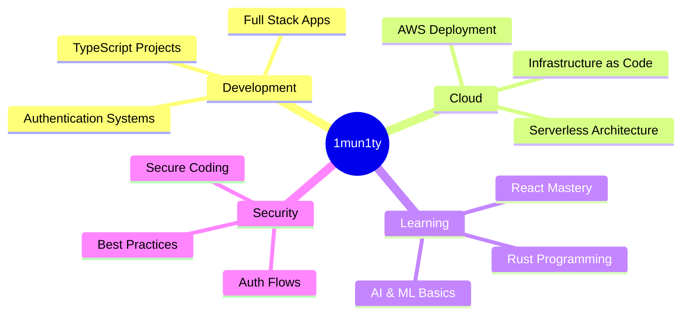

<div align="center">
  
# 👋 Welcome to my Digital Workshop


</div>

---

## 🧑‍💻 About Me

I'm a developer passionate about building secure, scalable applications and exploring new technologies. Currently diving deep into cloud architecture, authentication systems, and modern web frameworks.

```typescript
const developer = {
    name: "1mun1ty",
    location: "Lahore, Pakistan",
    currentFocus: ["AWS Deployment", "Authentication Systems", "Rust Programming"],
    learning: ["React", "Machine Learning", "Cloud Architecture"],
    interests: ["Backend Development", "Security", "AI/ML"]
};
```

- 🔭 **Current Projects:** Building a full-stack tracker app with TypeScript
- 🦀 **Exploring:** Rust programming and systems development
- ☁️ **Cloud Journey:** Deploying applications on AWS
- 🔐 **Security Focus:** Implementing robust authentication solutions
- 📚 **Always Learning:** AI/ML fundamentals and advanced React patterns

---

## 🛠️ Tech Stack & Tools

### Languages


### Frontend


### Backend & Cloud


### Tools & Platforms


---

## 📊 GitHub Analytics

<div align="center">
  
  
</div>

<div align="center">
  
</div>

<div align="center">
  
</div>

---

## 🚀 Featured Projects

<div align="center">

[](https://github.com/1mun1ty/tracker)
[](https://github.com/1mun1ty/Guessing_Game_In_Rust)

[](https://github.com/1mun1ty/P-1-Auth)
[](https://github.com/1mun1ty/AWS-Deploy)

</div>

---

## 🎯 Current Focus Areas



---

## 📈 Contribution Graph

<div align="center">
  
</div>

---

## 💡 Dev Quote

<div align="center">
  


</div>

---

## 🤝 Let's Connect

<div align="center">

[](https://github.com/1mun1ty)
[](https://linkedin.com/in/yourprofile)
[](https://twitter.com/yourhandle)
[](mailto:your.email@example.com)

</div>

---

<div align="center">
  
### 💭 "Code is like humor. When you have to explain it, it's bad." - Cory House


**Thanks for visiting! ⭐ Feel free to explore my repositories and reach out!**

</div>

---

<div align="center">
  
</div>
